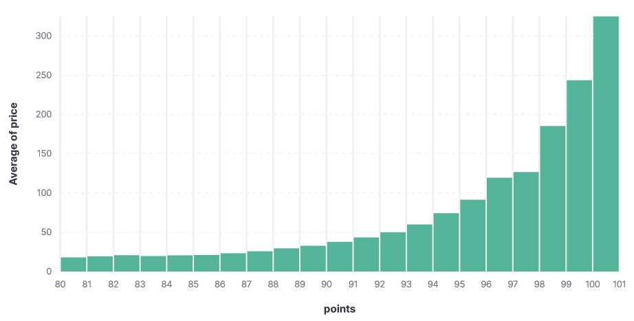

# Лабораторная работа 1

## NiFi

Начнем с части работы, посвященной работе с `Apache NiFi`. Для реализации предложенного пайплайна были сконфигурированы следующие процессоры:
* GetFile - для считывания файлов. В конфигурации была настроена директория, в которой находятся файлы, а также паттерн названия файлов
* UpdateAttribute - этот процессор был добавлен с целью переименования всех считанных файлов, дабы в конце они объединялись в один большой файл, а не в 26, как было изначально
* SplitRecord - разделение файлов на строки
* QueryRecord - осуществление фильтрации строк. Для этого был реализован следующий SQL-скрипт: 
```sql
SELECT * FROM FLOWFILE WHERE designation IS NOT NULL AND region_1 IS NOT NULL
```
* UpdateRecord - замена всех `null` в поле `price` на `0.0`. Для этого в конфигурацию был добавлен параметр `/price` со значением `${field.value:replaceNull(0.0)}`
* MergeRecord - первый этап объединения. Как выяснилось, в итоге довольно много строк надо объединить, поэтому дабы ничего не потерять, было принято решение производить объединение в несколько этапов (двух хватило). Первый этап - объединяем в крупные блоки (было установлено 3000-5000 записей). Также вместо `MergeContent` был использован `MergeRecord`, чтобы строка заголовка не повоторялась много раз
* MergeRecord - второй этап объединения. Тут объединяем прилитевшие блоки в один большой файл. Если бы мы просто в первом этапе объединяли большое количество строк, то переполнилась бы очередь и пайплайн бы встал...
* PutFile - сохранение файла
* PutElasticsearchHttpRecord - сохранение строки в Elasticsearch. Использование `PutElasticsearchHttp` постоянно приводило к ошибкам валидации, поэтому дабы не добавлять блок конвертации `csv` в `json`, данный процессор был заменен на `PutElasticsearchHttpRecord`, что решило возникшую проблему
* LogMessage - процессор был добавлен чисто для контроля, что сохранение в Elasticsearch заканчивается с флагом `success`

С полной конфигурацией данного пайплайна можно ознакомиться в соответствующем `xml`-файле

## Airflow

Теперь перейдем к части работы, связанной с `Apache Airflow`.

Здесь был реализован слегка отличающийся пайплайн, ибо некоторые шаги были лишены смысла из-за широких возможностей библиотеки `pandas`, с помощью которой осуществлялась работа с `csv`-файлами. Итоговый `DAG` состоит из следующих `tasks` (функции тасок сопровождались декоратором `@task`, что позволило в дальнейшем не использовать класс `PythonOperator`):
* read_files - считываем `csv`-файлы и объединяем их в один для дальнейшей обработки, результат сохраняем в буфер для передачи следующей таске (просто буферный `csv`-файл)
* dropna - удаляем строки, у которых в столбцах `designation` или `region_1` стоит `null`, результат сохраняем в буферный файл
* fillna - заменяем все `null` столбце `price` на `0.0`, результат сохраняем в буферный файл
* save_to_out - сохраняем результат в итоговый файл (в целом, можно было сделать на предыдущем этапе, но предположим, что у нас может добавиться еще какая-нибудь обработка)
* save_to_elasticsearch - сохранение в `Elasticsearch`: каждая строка датафрейма преобразуется в `json` и сохраняется в `Elasticsearch`

В конце все таски объединяются в `DAG`  по следующей схеме:
```py
read_task >> drop_task >> fill_task >> [to_csv_task, to_es_task]
```

## Kibana

Здесь все был создан `Index Pattern`, с помощью которого далее проиводилась визуализация диаграммы

